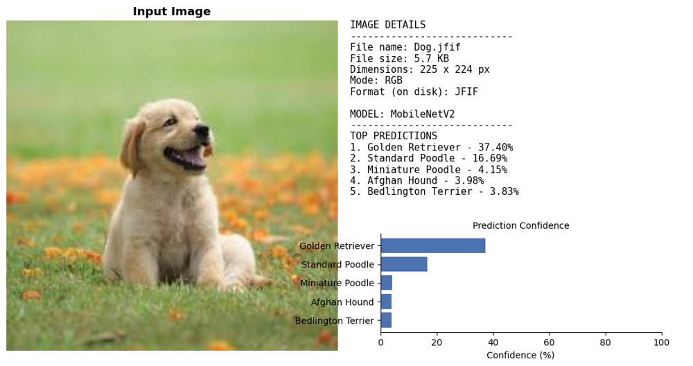

# Image Classifier

Classify any image with pretrained deep-learning models (**MobileNetV2**, **ResNet50**, **EfficientNetB0**) trained on ImageNet. It prints an image report, the top-K predictions with confidence scores, and a visualization.

> This is an image **classifier** (it names what is in the picture, from 1,000 ImageNet classes). It does not draw bounding boxes around objects.



## Features

- Three pretrained models, selectable with one flag
- Image details: file name, size, dimensions, mode, format
- Top-K predictions with confidence percentages
- Visualization with the image, report text and a confidence bar chart
- Clear errors for missing or invalid images
- Works with `.jpg`, `.png`, `.jfif` and other PIL-supported formats

## Project structure

```
image-classifier/
├── image_classifier/
│   ├── models.py          # Model registry and loading (lazy TensorFlow import)
│   ├── preprocessing.py   # Image loading and metadata
│   ├── predict.py         # Inference
│   └── report.py          # Console report and plots
├── notebooks/
│   └── Detecter.ipynb     # Original notebook version
├── tests/
├── assets/                # README screenshot
├── samples/               # Put your test images here
├── main.py                # CLI entry point
└── requirements.txt
```

## Setup

Requires Python 3.10 - 3.12 (TensorFlow does not yet support every newer Python).

```bash
git clone https://github.com/kunalbhoye61/image-classifier.git
cd image-classifier
python -m venv .venv
.venv\Scripts\activate          # Windows
# source .venv/bin/activate     # Mac / Linux
pip install -r requirements.txt
```

## Usage

```bash
python main.py samples/dog.jpg
python main.py samples/dog.jpg --model resnet50 --top-k 3
python main.py samples/dog.jpg --model efficientnet --save outputs/result.png --no-show
```

| Option | Description |
|--------|-------------|
| `--model` | `mobilenet` (default), `resnet50`, `efficientnet` |
| `--top-k` | Number of predictions to show (default 5) |
| `--save PATH` | Save the visualization as an image |
| `--no-show` | Don't open a plot window |

The first run downloads the model weights (about 14 MB for MobileNetV2, about 100 MB for ResNet50).

### Example output

```
==================================================
IMAGE ANALYSIS REPORT
==================================================

--- Image Details ---
File name         : Dog.jfif
File size         : 5.7 KB
Dimensions        : 225 x 224 px
Mode              : RGB
Format (on disk)  : JFIF

--- Model Used ---
MobileNetV2

--- Top Predictions ---
1. Golden Retriever          confidence: 37.40%
2. Standard Poodle           confidence: 16.69%
3. Miniature Poodle          confidence: 4.15%
```

## Troubleshooting

**SSL certificate error while downloading weights** (some networks and proxies cause this). As a last resort, enable the workaround, which turns off certificate checking:

```bash
set ALLOW_INSECURE_SSL=1        # Windows cmd
$env:ALLOW_INSECURE_SSL=1       # PowerShell
export ALLOW_INSECURE_SSL=1     # Mac / Linux
```

## Tests

```bash
pip install -r requirements-dev.txt
pytest
```

## Notebook version

`notebooks/Detecter.ipynb` is the original notebook, which uses Google Colab's file upload widget.

## License

MIT
